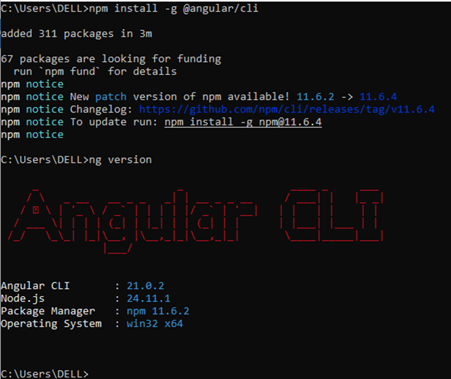
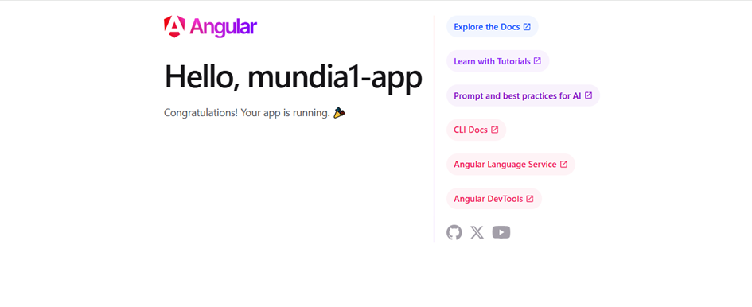
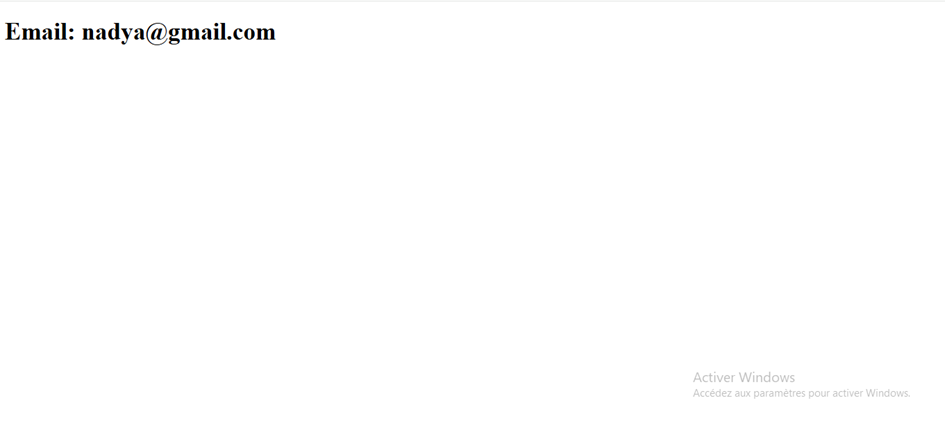
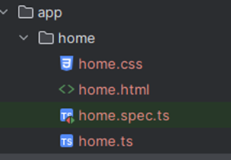
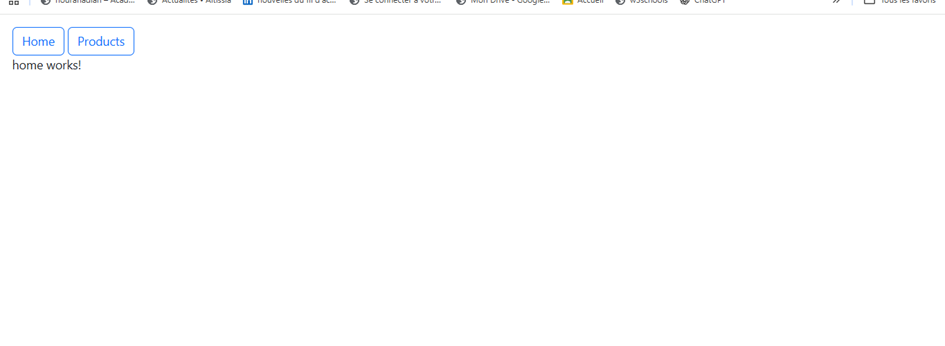
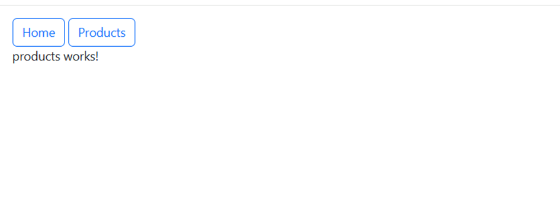
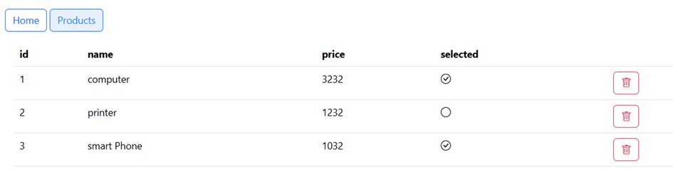
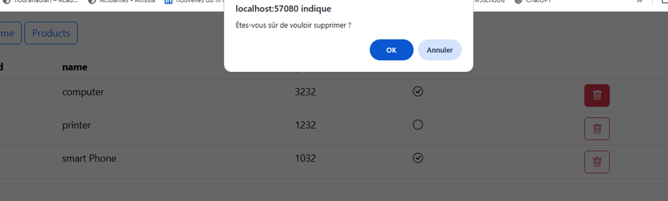
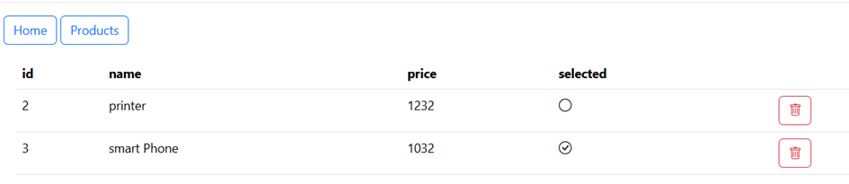

# First Angular TP 🚀

Ce projet représente mon **premier TP Angular**, réalisé pour découvrir les bases du framework Angular : installation, composants, routing, services et communication avec un backend.

---

## 📌 Prérequis

Avant de commencer, il faut installer **Node.js**.

* Télécharger Node.js depuis le site officiel
* Vérifier l’installation :

```bash
node -v
npm -v
```

---

## ⚙️ Installation d’Angular CLI

Angular CLI permet de créer et gérer facilement des projets Angular.

```bash
npm install -g @angular/cli
ng version
```




---

## 🎨 Installation de Bootstrap

Bootstrap est utilisé pour améliorer le design de l’interface.

```bash
npm install bootstrap
```

Puis l’ajouter dans le fichier de configuration du projet.

---

## 🧩 Premier test avec AppComponent

Dans le composant principal, on déclare une variable `email` :

```ts
export class App {
  email: String = "nadya@gmail.com";
}
```

Dans le fichier HTML associé :

```html
<h1>Email : {{ email }}</h1>
```


Cela permet de comprendre le **data binding** entre le fichier TypeScript et le HTML.

---

## 🏗️ Création des composants

Création de deux composants :

```bash
ng g c home
ng g c produits
```

Ces composants sont automatiquement ajoutés au projet et déclarés dans l’application.



---

## 🧭 Mise en place du Routing

Les routes sont ajoutées dans le fichier `app.routes.ts` :

```ts
{ path: "home", component: Home },
{ path: "products", component: Products }
```

Ensuite, on utilise le router dans `app.html` pour naviguer entre les pages.






---

## 🗑️ Suppression d’un produit avec confirmation

Lorsqu’on clique sur le bouton **Delete**, une boîte de confirmation s’affiche.



Après confirmation, le produit est bien supprimé de la liste.



---

## 🔧 Création d’un Service

Pour organiser la logique métier, un service est créé :

```bash
ng g s services/product
```

Cela crée automatiquement un dossier `services` contenant le service.

---

## 🌐 Communication avec le Backend

Pour communiquer avec le backend, on active le client HTTP dans `app.config.ts` :

```ts
provideHttpClient()
```

Dans le service `product.service.ts` :

```ts
getAllProducts() {
  return this.http.get("http://localhost:8080/products");
}

deleteProduct(product: any): Observable<Object> {
  return this.http.delete("http://localhost:8080/product/" + product.id);
}
```


Cela permet :

* de récupérer la liste des produits
* de supprimer un produit côté backend

---

## ✅ Conclusion

Ce TP m’a permis de :

* comprendre la structure d’un projet Angular
* créer des composants et des services
* utiliser le routing
* communiquer avec un backend via HTTP
* manipuler les données dynamiquement dans l’interface

C’est une première étape importante avant de réaliser des applications Angular plus avancées.
